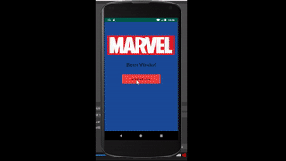

# Marvel-Store

Marvel Store é um app feito para disponibilizar diversos quadrinhos puxados da api https://developer.marvel.com e simular a venda dos mesmos. 

<h2>Funcionalidades</h2>

•O aplicativo lista todas as comics da api, sendo possível clicar em cada uma para ver mais detalhes das mesmas e adicioná-las ao carrinho, se desejado. 
•Ao clicar no carrinho na tela de catálogo, o usuário pode visualizar todos os itens adicionados e, se assim preferir, pode excluí-los clicando em cada um. 
•Existem 2 cupons que podem ser utilizados na tela de carrinho (cupomcomum, cupomraro). Cupons comuns descontarão 10% de comics não raras. Cupons raros descontarão 25% do preço de todas as comics. 
•12% de todas as comics listadas serão raras, geradas aleatoriamente. 
•Para melhor performance, não será mais necessário internet após carregar o catálogo uma primeira vez, sendo as próximas vezes carregadas por um banco de dados.

<h2>Métodos Utilizados</h2>
<h3>API REST e RecyclerView</h3>
  

  Para realizar o consumo de web service, foi utilizada a biblioteca Retrofit, juntamente com o convertor Gson. Observando a estrutura do REST com aplicações de terceiros, foi criado todo o modelo para obter todos os dados necessários e relevantes em uma única lista de objetos (neste caso, uma lista de objetos Result) para ser utilizado posteriormente na listagem de itens. O modelo então a ser usado como parâmetro na chamada call.enqueue foi um objeto da classe Catalog, que por sua vez tem objetos de outras classes como atributos, respeitando toda a estrutura do REST. 
  Uma vez realizada todo o web service, temos uma lista de Result, com todos os atributos relevantes para cada quadrinho, podendo assim ser facilmente aproveitada em uma RecyclerView que, através de um adaptador, lista todos os componentes configurados de forma otimizada.
  

<h3>SQLite e DbHelper</h3>
  

  Para tornar simples a utilização do Banco de Dados, foram criadas as classes CatalagoDAO e CarrinhoDAO, ambas com métodos de salvar, listar e, no carro do carrinho, deletar itens no banco de dados. Os métodos têm auxílio da classe SQLiteOpenHelper, facilitando bastante, assim, movimentos como adicionar e remover no banco de dados.
  

<h4>Estrutura do Banco de Dados</h4>

  Os componentes relevantes encontrados na api são:  •id  •title  •thumbnail  •prices  •description 
  Então, da mesma forma que o Result, foi criada a tabela "catalogo" com colunas de mesmo nome (com uma coluna a mais, para "raridade"). Esta tabela sempre será puxada na inicialização do app. Caso seja a primeira utilização do app, a tabela será criada com seus devidos valores. 
  Uma outra tabela foi criada para listar todos os itens adicionados no carrinho ("carrinho").
  

  
  <h2>Dificuldades Encontradas</h2>
  

  Sem sombra de dúvidas, minha maior dificuldade foi realizar todo o web service, pois eu ainda não tinha conhecimento do processo nem de bibliotecas convenientes para o caso, por (até agora) nunca ter feito algum projeto envolvendo este problema. Isto, junto com a falta de prática com RecyclerView, me gerou boas horas de (re)aprendizagem.
  

  <h2>Possíveis Melhorias</h2>
  

  •Todo o design e posicionamento de Views poderia ser melhorado, com toda a certeza. Não sou bom em escolher cores, imagens e etc. 
  •Há uma <italic>leve</italic> falha de otimização no RecyclerView de Catálogo, na MainActivity: Tive problemas para manter apenas os itens raros com títulos em vermelho por causa da própria implementação do RecyclerView, creio eu. Como ele reutiliza itens durante a listagem, quadrinhos que não eram raros acabavam ficando com título em vermelho. Como <strike>gambiarra</strike> solução, o CatalogoAdapter irá sempre setar a cor dos títulos dos quadrinhos sempre que forem visualizados na tela (preto para comuns, vermelho para raros). 
  •Testes não foram implementados por falta de tempo :( 
  •Sem pensar direito, foram criadas duas tabelas no banco de dados, mas apenas uma iria dar conta bastando adicionar uma coluna para informar se está ou não no carrinho. 
  •Adicionar uma thread de carregamento para informar o usuário de que o consumo de web service está em andamento.
